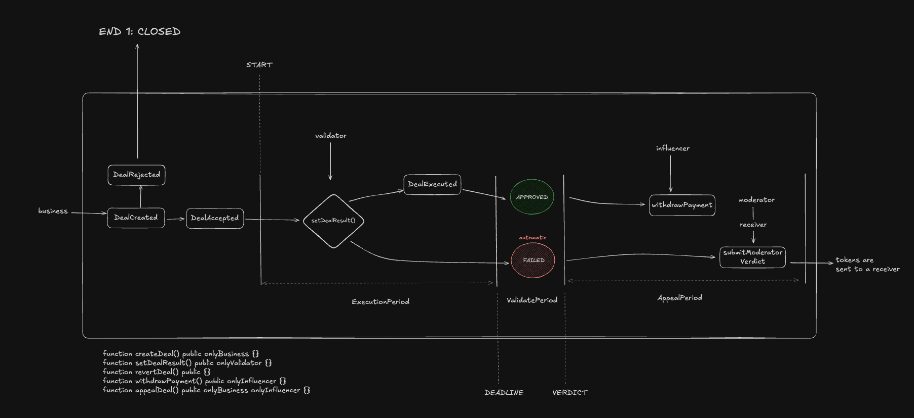

# Decentralized Deal Management System

A secure and transparent smart contract system for managing content creation deals between businesses and influencers, with built-in validation and moderation mechanisms.



## Overview

This system consists of two main smart contracts:

1. **AgentRegistry**: Manages validators and moderators who ensure the integrity of deals
2. **DealManager**: Handles the creation, validation, and execution of deals between businesses and influencers

## Key Features

### Deal Lifecycle

- **Creation**: Businesses create deals with specific validators and influencers
- **Acceptance**: Influencers accept deals they want to participate in
- **Validation**: Validators verify deal completion
- **Appeal**: Dispute resolution through moderator intervention
- **Payment**: Secure token transfers with automatic fee distribution

### Security Features

- Stake-based validator and moderator system
- Time-based deal deadlines and appeal periods
- Fee-based incentive structure
- Secure token handling with OpenZeppelin's SafeERC20

### Fee Structure

- Validator Fee: 2% of deal amount
- Moderator Fee: 10% of deal amount
- All fees are calculated using basis points for precision

## Technical Details

### Smart Contracts

#### AgentRegistry

- Manages validator and moderator roles
- Handles stake deposits and withdrawals
- Implements slash request mechanism for misbehavior

#### DealManager

- Handles deal creation and lifecycle
- Manages USDT token transfers
- Implements appeal and moderation system
- Uses precise fee calculations

### Time Constants

- Deal Lifespan: 2 weeks
- Appeal Period: 1 week
- Validation Period: 10 minutes

## Development

### Prerequisites

- Node.js
- Hardhat
- TypeScript

### Installation

```bash
npm install
```

### Testing

```bash
npx hardhat test
```

### Deployment

```bash
npx hardhat run scripts/deploy.ts --network <network>
```

## Contract Architecture

```
DealManager
├── Deal States
│   ├── CREATED
│   ├── APPLIED
│   ├── REJECTED
│   ├── VALIDATED
│   ├── APPEAL
│   └── CLOSED
│
└── Key Functions
    ├── createDeal
    ├── acceptDeal
    ├── setDealResult
    ├── appealDeal
    └── submitModeratorVerdict

AgentRegistry
├── Agent Types
│   ├── VALIDATOR
│   └── MODERATOR
│
└── Key Functions
    ├── joinAsAgent
    ├── leaveAsAgent
    └── requestSlash
```

## Security Considerations

1. **Token Safety**

   - Uses OpenZeppelin's SafeERC20 for secure token transfers
   - Implements proper allowance checks
   - Handles fee calculations with precision

2. **Access Control**

   - Role-based access for validators and moderators
   - Stake-based security model
   - Proper authorization checks

3. **Time Management**
   - Clear deadlines for deal completion
   - Structured appeal periods
   - Validation time windows
